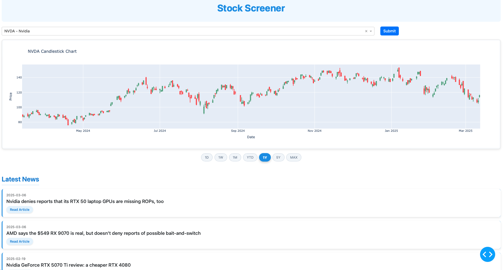

# Stock Screener

## **Overview**
A lightweight, interactive stock screener built with Dash and Plotly that allows users to visualize stock price data and related news. 

This application provides basic tooling for analyzing stocks through price charts with customizable time ranges and relevant news articles.



---
## **Deployment Guide**

### Deployment Options

1. **Render** (Recommended for simplicity)
   - Create an account on [Render](https://render.com/)
   - Create a new Web Service
   - Connect your GitHub repository
   - Use the following settings:
     - Build Command: `pip install -r requirements.txt`
     - Start Command: `gunicorn app:server`
   - Add environment variables: `NEWS_API_KEY`

2. **Heroku**
   - Create an account on [Heroku](https://heroku.com/)
   - Install the Heroku CLI
   - Run `heroku create`
   - Push your code with `git push heroku main`
   - Set environment variables with `heroku config:set NEWS_API_KEY=your_key`

3. **AWS Elastic Beanstalk**
   - Create an AWS account
   - Install the EB CLI
   - Initialize your application: `eb init`
   - Create the environment: `eb create`
   - Deploy: `eb deploy`

4. **Docker**
   - Build: `docker build -t stock-screener .`
   - Run: `docker run -p 8050:8050 -e NEWS_API_KEY=your_key stock-screener`
   - Deploy to any container service (AWS ECS, Google Cloud Run, etc.)

### Files Already Prepared

The project has been prepared for deployment with:
1. A `Procfile` for Heroku
2. A `Dockerfile` for container deployments
3. `gunicorn` added to requirements.txt
4. Server variable and port configuration in app.py

### Updating Your Deployed App

**Render**
- Automatic updates: When connected to GitHub, Render automatically deploys new commits pushed to your selected branch
- Manual updates: You can also trigger a manual deploy from the Render dashboard
- To change the URL: Go to Settings → General → Name → Update the name (free tier: yourname.onrender.com)

**Heroku**
- Updates deploy automatically when you push to the connected GitHub branch
- Or manually update with: `git push heroku main`
- To view logs: `heroku logs --tail`

**AWS Elastic Beanstalk**
- Update with: `eb deploy`
- View status: `eb status`
- View logs: `eb logs`

**Docker**
- Rebuild image: `docker build -t stock-screener .`
- Stop running container: `docker stop <container_id>`
- Run updated container: `docker run -p 8050:8050 -e NEWS_API_KEY=your_key stock-screener`
- For container services (ECS, GCP): Follow their specific update workflows

---
## **TODO / Roadmap**
- [ ] Add technical indicators (Moving averages, MACD, RSI)
- [ ] Implement custom date range selection
- [ ] Add basic metrics (P/E ratio, market cap, etc.)
- [ ] Compare metrics to S&P or sector average
- [ ] Include options data for selected stock
- [ ] Deploy app to webserver
- [ ] Simple financial statement analysis 
- [ ] Add dark mode toggle


---
## **Future Improvements**
- Implement portfolio tracking functionality
- Add financial statements visualization
- Include options data for selected stocks
- Basic financial modeling
- Deployment (hopefully soon)


---
## **Features**
- **Interactive Stock Search**: Search for any stock using ticker symbols from the S&P 500
- **Candlestick Charts**: Visualize price movements with adjustable time ranges (1D, 1W, 1M, YTD, 1Y, 5Y, MAX)
- **Latest News**: Display recent news articles related to the selected company
- **Responsive Design**: Built with Bootstrap components for a clean, mobile-friendly interface

---
## **Data Sources & APIs**
This project leverages the following data sources:

| **Data Type**      | **Source/API**           |
|--------------------|--------------------------|
| Stock Price Data   | Yahoo Finance API        |
| Company News       | News API                 |
| Company Listings   | Wikipedia (S&P 500 list) |

---
## **Repository Structure**
```
📂 /stock-screener
│── 📜 app.py                   → Main Dash application
│── 📦 requirements.txt         → Python dependencies
│── 📖 README.md                → Project documentation
│── 📄 .env                     → API keys (not committed to Git)
│
├── 📊 data/
│   └── 📈 tickers.csv          → List of available stock tickers
│
├── 📓 fetch_tickers.ipynb      → Notebook for fetching ticker data
│
└── 🔍 utils/
    └── 📡 fetch_data.py        → Functions for data retrieval
```

---
## **Setup & Installation**
### **Prerequisites**
- Python 3.8+
- pip or uv package installer

### **Installation**
```bash
# Clone the repository
git clone https://github.com/dylanmcd0/stock-screener.git
cd stock-screener

# Create virtual environment
python -m venv venv

# Activate virtual environment
# On Windows:
venv\Scripts\activate
# On macOS/Linux:
source venv/bin/activate

# Install dependencies
# Using pip:
pip install -r requirements.txt
# Or using uv (faster):
uv pip install -r requirements.txt
```

### **API Keys**
Create a `.env` file in the root directory and add your News API key:
```
NEWS_API_KEY=your_news_api_key_here
```

You can obtain a free News API key from [newsapi.org](https://newsapi.org/).

---
## **Running the Application**
```bash
python -m app
```

Navigate to http://127.0.0.1:8050/ in your web browser to use the application.

---
## **Author**
👤 **Dylan R. McDonald**  
💼 **Commodities Technology Associate | Aspiring Investment Analyst**  
📧 **dylmcdona@icloud.com**  
